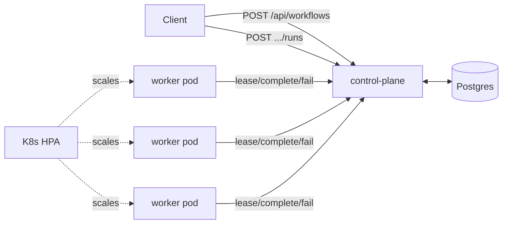

# FlowForge Architecture

## Overview

FlowForge is split into two independently-scalable services that share no
state except Postgres:

- **control-plane** (Java / Spring Boot) — the brain. Owns workflow
  definitions, DAG validation, task scheduling, retries, timeouts, and
  checkpointed state. Stateless itself — every fact about a running workflow
  lives in Postgres, so any number of control-plane replicas can run behind
  a load balancer with no coordination between them.
- **worker** (Go) — the muscle. A lightweight polling agent that leases one
  task at a time, runs it, and reports back. Workers don't know about the
  DAG at all; they only know "run this command, report success or failure."



## The DAG model

A workflow definition is a flat list of tasks, each naming its upstream
dependencies by task name:

```json
{
  "name": "etl-pipeline",
  "tasks": [
    { "name": "extract", "command": "…" },
    { "name": "transform", "dependsOn": ["extract"], "command": "…" },
    { "name": "load", "dependsOn": ["transform"], "command": "…" }
  ]
}
```

`DagValidator` runs a Kahn's-algorithm topological sort at registration
time: every `dependsOn` reference must exist, task names must be unique,
and if the sort can't consume every node, the graph has a cycle and the
definition is rejected before it's ever persisted.

## Scheduling: leasing instead of pushing

Rather than the control plane pushing tasks to specific workers (which
would need service discovery and per-worker addressing), workers **pull**:

```
POST /api/workers/{workerId}/lease
```

Under the hood this runs:

```sql
SELECT * FROM task_runs
WHERE status = 'READY' AND next_attempt_at <= now()
ORDER BY created_at
LIMIT 1
FOR UPDATE SKIP LOCKED
```

`FOR UPDATE SKIP LOCKED` is what makes this safe under concurrency: if two
workers (or two control-plane replicas handling two workers) race for the
same row, the loser simply skips it and looks at the next one instead of
blocking. This is the same primitive production job queues (e.g. Postgres-
backed queues like `pgqueuer`, `pgboss`) use to get exactly-once leasing
without a separate broker like Kafka or RabbitMQ — which keeps the
infrastructure footprint to just Postgres.

Once claimed, a task moves `READY → RUNNING`, gets a `lease_expires_at`
timestamp (now + its configured timeout), and is handed to the worker along
with the checkpoint output of every task it depends on — this is how data
flows through the DAG without a separate message bus.

## Retry policy, timeouts, and crash-safety

Every task carries `maxRetries` and `timeoutSeconds` (defaulted at the
workflow level, overridable per-task). Three ways a task can leave
`RUNNING`:

1. **Success** — worker calls `/complete`, task → `SUCCEEDED`, its
   checkpoint output is persisted, and the scheduler re-evaluates the DAG to
   promote any downstream `PENDING` task whose dependencies are now all
   satisfied.
2. **Explicit failure** — worker calls `/fail`. If `attempt < maxRetries`,
   the task goes back to `READY` with a linear backoff delay
   (`next_attempt_at`); otherwise it's `FAILED` permanently.
3. **Timeout / worker death** — the worker crashes, is OOM-killed, or the
   pod is evicted mid-task, and no callback ever arrives. `LeaseReaperService`
   sweeps every 5 seconds (configurable) for `RUNNING` tasks past their
   `lease_expires_at` and feeds them into the *exact same* retry/failure path
   as an explicit `/fail` call.

This is what makes the system crash-safe end to end: because state
transitions are transactional writes against Postgres rather than in-memory
scheduler state, killing a control-plane pod loses nothing — a replacement
pod (or a HA replica) resumes scheduling by reading the same tables, and the
reaper independently guarantees no task can be lost to a dead worker.

When a task permanently fails, `cascadeSkip` marks every remaining
`PENDING`/`READY` task in that run as `SKIPPED` (they can never satisfy
their dependency now) and the workflow run is marked `FAILED`.

The reaper claims expired leases with the same `FOR UPDATE SKIP LOCKED`
pattern as leasing, so several control-plane replicas can run it
concurrently without reclaiming the same task twice.

### Stale callbacks

A worker whose lease was reclaimed may still finish later and call
`/complete` or `/fail`. Accepting that report would overwrite the state of
the newer attempt, so both endpoints only act on tasks that are still
`RUNNING` and otherwise answer `409 Conflict`. The worker treats a 409 as
"lease lost" and discards the result.

## Cancel and resume

`POST /api/workflows/runs/{id}/cancel` moves every unfinished task to
`CANCELLED` and the run to `CANCELLED`; a worker that is mid-task gets a 409
when it reports back.

`POST /api/workflows/runs/{id}/retry` resumes a `FAILED` or `CANCELLED`
run. Tasks that already `SUCCEEDED` keep their status and checkpoint output
and are not re-executed; everything else is reset to `PENDING` with a fresh
attempt budget and promoted to `READY` as its dependencies allow. This is
the practical payoff of durable checkpoints: a failure at the end of a long
pipeline doesn't mean redoing the expensive early stages.

## Checkpointing

Each task's `checkpoint_data` column holds whatever output it produced,
persisted at the moment of success — nothing is held only in worker memory.
This does two things: it's the mechanism by which task N+1 receives task N's
output (passed back in the lease response's `upstreamCheckpoints` map, which
the worker exposes to the command as `FLOWFORGE_UPSTREAM_<TASK>` and
`FLOWFORGE_UPSTREAM_JSON` environment variables), and
it means a workflow run's full execution trace is durable and inspectable
via `GET /api/workflows/runs/{id}` even long after the run finishes.

## Horizontal scaling

- **Workers** scale via a Kubernetes HPA on CPU utilization (3–20 pods).
  Because leasing is a stateless, idempotent pull, adding or removing worker
  pods requires no coordination — the pool just contends for `READY` rows
  more or less aggressively.
- **Control-plane** replicas are stateless and can scale behind the K8s
  Service the same way; the only shared resource is Postgres, and the
  scheduler's hot-path queries (`idx_task_runs_ready_lease`,
  `idx_task_runs_running_lease`) are indexed specifically for the lease and
  reaper queries to keep contention low as both scale.

## Load testing

`load-test/` is a small Go program that registers a 3-task DAG, fires N
concurrent workflow runs at the control plane, polls each to completion, and
reports throughput (runs/sec) and p50/p95/p99 run latency — see the root
README for how to run it against a docker-compose or Kubernetes deployment.
